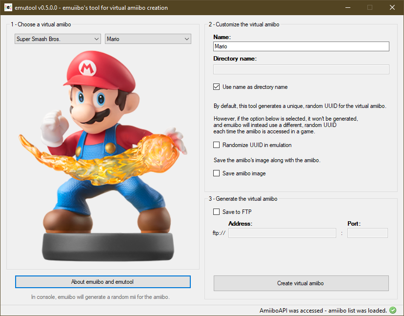

# emuiibo

> Virtual amiibo (amiibo emulation) system for Nintendo Switch

# Table of contents

1. [Usage](#usage)
2. [Controlling emuiibo](#controlling-emuiibo)
3. [Virtual amiibo creation](#virtual-amiibo-creation)
4. [Important notes](#important-notes)
5. [For developers](#for-developers)
6. [Credits](#credits)

## Usage

Build or download the latest release of emuiibo and extract the contents of 'SdOut' in the root of your SD card.

emuiibo comes bundled with a Tesla overlay to control it quite easily, but tools such as Goldleaf, Amiigo... can be used as a controller too.

### SD layout

- Emuiibo's directory is `sd:/emuiibo`.

- Virtual amiibos go inside `sd:/emuiibo/amiibo`. For instance, an amiibo named `MyMario` would be `sd:/emuiibo/amiibo/MyMario/<amiibo content>`.

- A virtual amiibo is detected by emuiibo based on two aspects: a `amiibo.json` and a `amiibo.flag` fioe must exist inside the virtual amiibo's folder mentioned above. If you would like to disable a virtual amiibo from being recognised by emuiibo, just remove the flag file, and create it again to enable it.

- Every time the console is booted, emuiibo saves all the miis inside the console to the SD card. Format is `sd:/emuiibo/miis/<index> - <name>/mii-charinfo.bin`.

## Controlling emuiibo

- **Emulation status (on/off)**: when emuiibo's emulation status is on, it means that any game trying to access/read amiibos will be intercepted by emuiibo. When it's off, it means that amiibo services will work normally, and nothing will be intercepted. This is basically a toggle to globally disable or enable amiibo emulation.

- **Active virtual amiibo**: it's the amiibo which will be sent to the games which try to scan amiibos, if emulation is on. Via tools such as the overlay or Goldleaf, one can change the active virtual amiibo.

- **Virtual amiibo status (connected/disconnected)**: when the active virtual amiibo is connected, it means that the amiibo is always "placed", as if you were holding a real amiibo on the NFC point and never moving it - the game always detects it. When it is disconnected, it means that you "removed" it, as if you just removed the amiibo from the NFC point. Some games might ask you to remove the amiibo after saving data, so you must disconnect the virtual amiibo to "simulate" that removal. This is a new feature in v0.5, which fixed errors, since emuiibo tried to handle this automatically in previous versions, causing some games to fail.

All this aspects can be seen/controlled via the overlay.

## Virtual amiibo creation

Emuiibo no longer requires raw BIN dumps (but allows them) to emulate amiibos. Instead, you can use `emutool` PC tool in order to generate virtual amiibos.

## For developers

emuiibo also hosts a custom service, `nfp:emu`, which can be used to control amiibo emulation by IPC commands.

NOTE: this service has completely changed for v0.5, so any kind of tool made to control emuiibo for lower versions should be updated, since it will definitely not work fine.

There are two examples for the usage of this services: `emuiibo-example`, which is a quick but useful CLI emuiibo manager, and the overlay we provide.

> TODO: extend this documentation a little bit more (random UUID, amiibo structure...)

## Credits

- Everyone who contributed to the original **nfp-mitm** project (forks): *Subv, ogniK, averne, spx01, SciresM*

- **libstratosphere** project and libraries

- **AmiiboAPI** web API, which is used by `emutool` to get a proper, full amiibo list, in order to generate virtual amiibos.

- [**3DBrew**](https://www.3dbrew.org/wiki/Amiibo) for their detailed documentation of amiibos, even though some aspects are different on the Switch.

- **AD2076** for helping with the tesla overlay.

- **Thog** and **Ryujinx** devs for reversing mii services and various of its types.

- **Citra** devs for several amiibo formats used in 3DS systems.